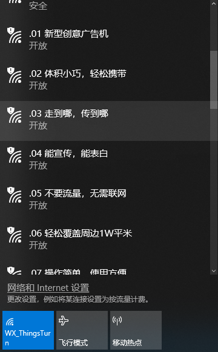
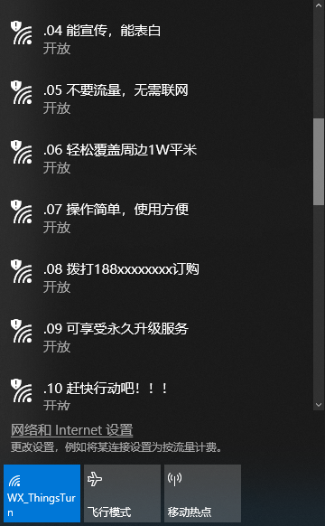

## W600 Beacon Spam

Use a W600  device to create multiple custom WiFi access points,  can be used for advertising.

### Build
```
cd <SDK dir>
mv App App.bak
cp -r Examples/adc App
make -C Tools/GNU
make -C Tools/GNU flash
```

### Usage

```
tio -e -b 115200 /dev/ttyUSB0 -m ONLCRNL

w600 beacon spam example, compile @Apr 19 2019 11:56:01

task start ... 
```

Step 2:

Turn on the WiFi display on your computer or mobile phone

  


### About

Please visit www.thingsturn.com or contact support@thingsturn.com


